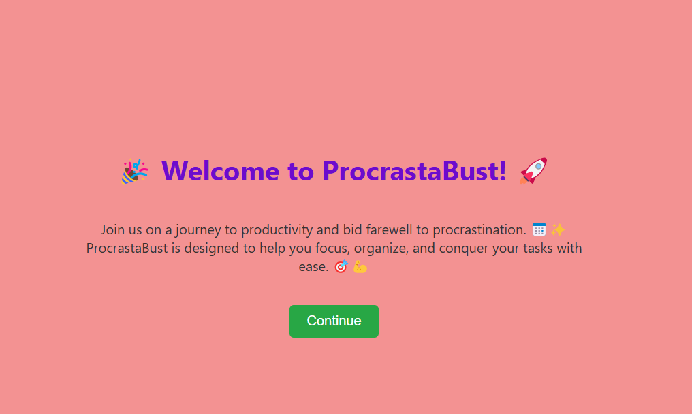

# Procrastination Website
<p align="center">
  
</p>

**Developed for a 24-Hour Hackathon Challenge**

## Overview

The Procrastination Website was created during a 24-hour hackathon challenge. This web application is designed to help users manage their tasks more effectively, motivate them to complete their tasks, and provide a structured approach to breaking down tasks into manageable chunks.

## Features

- **Signup Page:** Users can create an account to start managing their tasks. The signup process is simple and user-friendly.
- **Task Management:** Users can enter their tasks and set deadlines for them. The website helps in organizing and prioritizing tasks.
- **Motivation System:** Provides motivational prompts and encouragement to keep users focused and driven to complete their tasks.
- **Task Breakdown:** Users can input the duration required for each task. The website then splits the task into smaller segments with breaks in between to make it more manageable.
- **Feedback Page:** Users can leave feedback on their experience with the website, which helps in improving the application.

## Technologies Used

- **Frontend:** HTML, CSS, JavaScript

## Installation

To run the Procrastination Website locally, follow these steps:

1. **Clone the Repository:**

    ```bash
    git clone https://github.com/your-username/procrastination-website.git
    ```

2. **Navigate to the Project Directory:**

    ```bash
    cd procrastination-website
    ```


## Usage

1. **Signup:** Register an account on the signup page.
2. **Add Tasks:** Enter tasks you need to complete and set deadlines.
3. **Motivation:** Receive motivational prompts to stay focused.
4. **Breakdown Tasks:** Input the duration for each task to receive a structured breakdown with intervals and breaks.
5. **Feedback:** Provide feedback through the feedback page to help improve the application.


